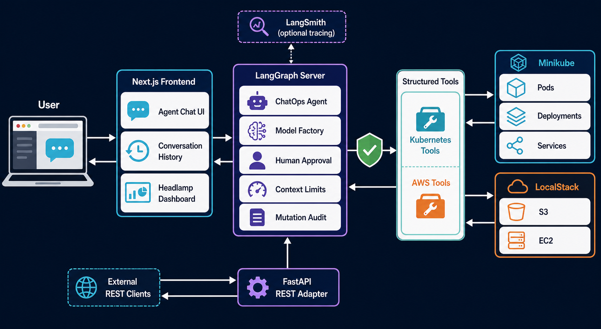
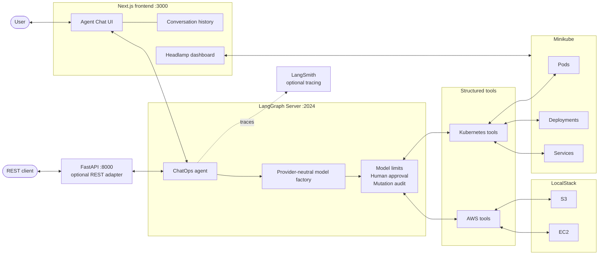
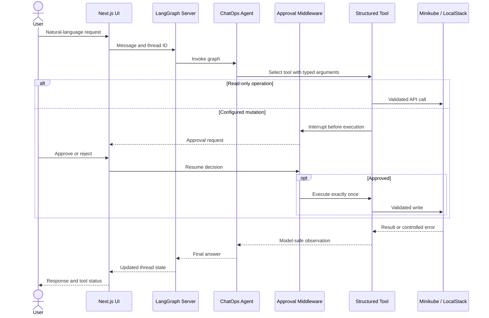
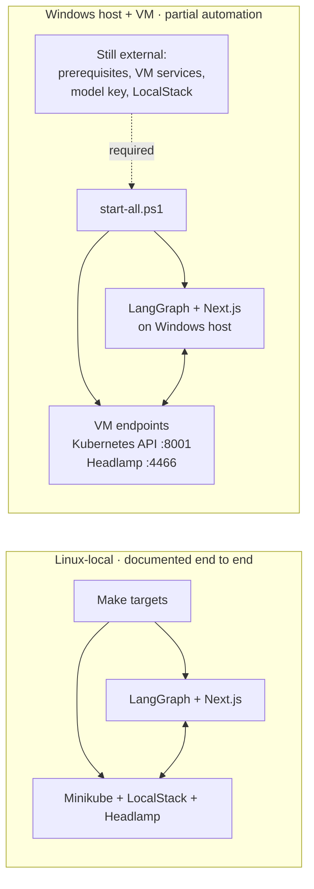
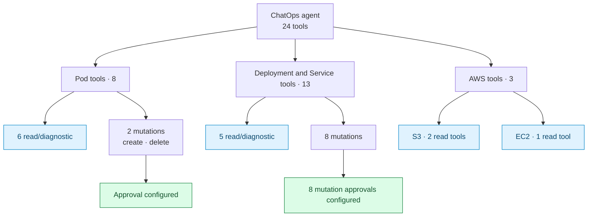
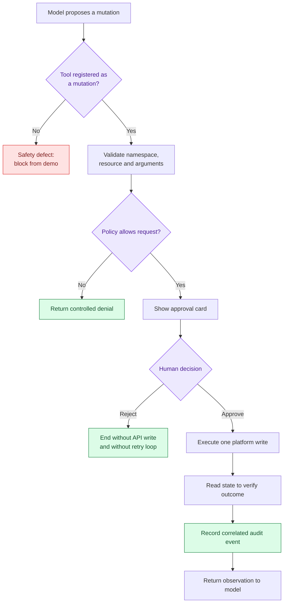
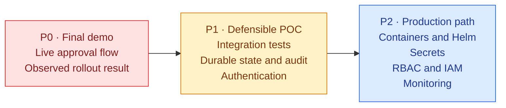

# ChatOps Project Handoff

Last reviewed: 26 July 2026

## 1. Project status

ChatOps is a functional local proof of concept for operating Kubernetes and AWS
resources through natural-language requests. It currently connects:

- a Next.js chat interface based on the open-source LangChain Agent Chat UI;
- a LangGraph agent served by LangGraph Server;
- Minikube through the Kubernetes Python client;
- LocalStack through `boto3`;
- Headlamp as the Kubernetes dashboard beside the chat;
- optional LangSmith tracing;
- an optional FastAPI adapter that calls the same agent domain.

The project is suitable for a controlled local demonstration. It is **not yet
production-ready** because application authentication, durable authorization
and audit storage, production conversation persistence, deployment packaging,
and deterministic Deployment rollout verification are still missing.

ChatOps is not coupled to the OpsTasks demo application. OpsTasks is only one
possible workload used to exercise the Minikube tools.

### Internship mandate and delivery status

The project was developed within the Talan Tunisia DevOps team. The internship
subject asked for an AI-assisted ChatOps solution for Cloud and Kubernetes
environments, including automated actions, monitoring, diagnostics, log
analysis, recommendations, containerized deployment, and architecture/deployment
documentation.

| Internship objective | Current evidence | Handoff status |
| --- | --- | --- |
| Study automatable DevOps use cases | Pod, Deployment, S3, and EC2 workflows were evaluated and implemented | Delivered for the POC scope |
| Select the technical stack | LangGraph/LangChain, FastAPI, Kubernetes SDK, Boto3, Minikube, LocalStack, Next.js, and Headlamp | Delivered and documented |
| Execute simple DevOps actions from chat | 24 structured read, diagnostic, and mutation tools | Delivered with the mutation caveats below |
| Monitor and diagnose services/containers | Pod status, logs, events, container diagnosis, rollout status/history, and selector verification | Delivered for the supported resources |
| Analyze logs and recommend actions with AI | Bounded logs/events are provided to the model for explanation and recommendations | Delivered as a POC; no formal accuracy evaluation |
| Deploy in a containerized environment | Minikube and LocalStack are used as targets, but ChatOps itself has no production container packaging | Not completed |
| Document architecture and deployment | Root README, component READMEs, Linux setup, environment reference, visual handoff, and local engineering notes | Delivered for Linux-local development |

The official requirements describe the intended outcome. The safety and
production sections of this handoff describe what is actually ready today.

## 2. Architecture and request flow



The image above is intended for reports and presentations. The editable Mermaid
diagram below is the technical source of truth:



For a normal chat request:

1. The frontend sends the message and thread identifier to LangGraph Server.
2. The model selects an exposed tool when infrastructure data or an operation
   is required.
3. The tool validates model input and delegates to a platform service.
4. The service enforces platform safety policy and calls Kubernetes or AWS.
5. Read results are returned to the model. Configured mutations interrupt the
   graph and wait for an explicit approve or reject decision.
6. The final answer and updated thread state return to the frontend.



## 3. Documentation map and source of truth

| Document | Audience and purpose |
| --- | --- |
| [`README.md`](../README.md) | Project overview and shortest supported Linux startup path |
| [`docs/HANDOFF.md`](HANDOFF.md) | Architecture, capabilities, risks, component responsibilities, demo flow, and next priorities |
| [`docs/setup/linux/README.md`](setup/linux/README.md) | Complete supported Linux-local setup and troubleshooting |
| [`docs/setup/linux/environment-variables.md`](setup/linux/environment-variables.md) | Every backend/frontend environment setting and its safety impact |
| [`backend/README.md`](../backend/README.md) | Direct FastAPI and LangGraph backend commands plus LangSmith notes |
| [`frontend/README.md`](../frontend/README.md) | UI configuration, Headlamp embedding, production proxy, and attribution |
| [`scripts/setup/windows-vm/start-all.ps1`](../scripts/setup/windows-vm/start-all.ps1) | Partial Windows/VM endpoint and process launcher |

When documents disagree, use this order:

1. source code and passing tests;
2. this handoff and the root README;
3. environment-specific setup documentation;
4. component READMEs;

## 4. First-day setup

The supported end-to-end automated workflow is currently Linux local
development. The project also includes a
[Windows/VM launcher](../scripts/setup/windows-vm/start-all.ps1) that updates
the VM endpoints and starts LangGraph Server and the frontend, but it is not
yet a complete environment bootstrap or runbook.



```bash
make doctor
make setup
```

Add a valid model provider, model name, and API key to `backend/.env`. Never
commit that file. Then prepare the local platforms:

```bash
make minikube
make localstack
make headlamp-install
```

Start the application in separate terminals:

```bash
make backend
make frontend
make headlamp
```

Open <http://localhost:3000> and generate a temporary Headlamp token when
needed:

```bash
make headlamp-token
```

Use these references for the full procedure:

- [Linux setup](setup/linux/README.md)
- [Environment variables](setup/linux/environment-variables.md)

The frontend uses LangGraph Server on port `2024`. Starting FastAPI on port
`8000` is optional unless a REST client or the Windows/VM workflow needs it.

## 5. Source map and responsibilities

| Area | Main files | Responsibility |
| --- | --- | --- |
| Agent assembly | `backend/app/agent/agent.py` | Registers tools and middleware |
| LangGraph entry point | `backend/app/agent/graph.py` | Builds the graph served from `langgraph.json` |
| Model selection | `backend/app/agent/models/factory.py` | Creates a provider-neutral LangChain chat model |
| System behavior | `backend/app/agent/prompts/system.py` | Language, safety, and response rules |
| Agent middleware | `backend/app/agent/middleware/` | Model limits, mutation audit, approval support |
| Kubernetes tools | `backend/app/agent/tools/kubernetes/` | Schemas, tool descriptions, and model-facing formatting |
| Kubernetes services | `backend/app/platforms/kubernetes/services/` | Kubernetes API operations |
| Kubernetes policy | `backend/app/platforms/kubernetes/safety/` | Namespace and resource validation |
| Kubernetes execution | `backend/app/platforms/kubernetes/execution/` | Shared API error translation |
| AWS tools | `backend/app/agent/tools/aws/` | AWS tool descriptions and formatting |
| AWS services/models | `backend/app/platforms/aws/` | `boto3` calls and typed service data |
| REST adapter | `backend/app/api/` | Optional FastAPI routes and dependencies |
| Frontend | `frontend/src/` | Chat, thread history, branding, and Headlamp layout |
| Local automation | `Makefile`, `scripts/setup/linux/` | Local bootstrap and run commands |
| Windows/VM launcher | `scripts/setup/windows-vm/start-all.ps1` | Windows/VM endpoint generation and process startup |
| CI | `.github/workflows/ci.yml` | Backend and frontend validation |

Project responsibility boundaries for handoff:

- the Linux-local Make workflow and documentation are the supported reference
  path;
- the Windows/VM launcher is part of the shared project but still needs a
  complete setup and troubleshooting guide;
- OpsTasks is an independent test workload and must not become a ChatOps
  bootstrap dependency;
- the upstream Agent Chat UI remains MIT-licensed code customized inside
  `frontend/`;
- any future tool change must include its service contract, policy,
  approval/audit classification, formatting, and tests—not only its tool
  function.

## 6. Implemented capabilities

The current registry exposes 24 tools.



### Kubernetes Pods

Read and diagnosis:

- list Pods in an allowed namespace;
- inspect one Pod;
- retrieve bounded current or previous container logs;
- retrieve Pod events;
- diagnose container states and restart reasons;
- combine Pod details and events into a describe-style response.

Mutations:

- create a secured standalone test Pod after approval;
- delete a Pod after approval.

Standalone Pod creation includes namespace and name validation, an allowed
public-registry policy, image-manifest verification, resource requests and
limits, disabled service-account token mounting, restricted privileges,
dropped Linux capabilities, `RuntimeDefault` seccomp, and a deliberate
`Never` restart policy.

### Kubernetes Deployments

Read and diagnosis:

- list Deployments;
- inspect one Deployment;
- inspect rollout status;
- inspect revision history;
- verify whether a Service selector matches live Pods.

Mutations:

- create and delete a Deployment;
- scale and restart a Deployment;
- update a container image;
- roll back a Deployment;
- pause and resume a rollout.

All eight Deployment mutations use the same approve/reject and execution-audit
middleware. Mutation results report that Kubernetes accepted the request; they
do not claim rollout convergence without a follow-up read.

### AWS through LocalStack

- list S3 buckets;
- list S3 objects by bucket and optional prefix;
- list EC2 instances with an optional state filter.

The AWS feature set is intentionally small and read-only at this stage.

### Agent reliability

- model and agent calls have bounded timeouts and retries;
- older large tool observations are removed from the active model context;
- known provider quota and context-limit errors become safe user messages;
- the provider `role:tool` content error now becomes a user-facing message
  instead of exposing its traceback.

## 7. Safety state

| Control | Current state | Production note |
| --- | --- | --- |
| Namespace allowlist | Enforced by Kubernetes services | Must be combined with per-user authorization |
| Real Kubernetes gate | Disabled by default | Keep disabled until real-cluster access is designed |
| Real AWS gate | Disabled by default | Keep disabled until IAM and authorization are designed |
| Standalone Pod image policy | Registry allowlist and public manifest check | Add private-registry authentication only with secret handling |
| Pod create/delete approval | Implemented and tested | Needs authenticated approver identity |
| Deployment mutation approval | All eight create/delete/lifecycle mutations are configured and tested | Needs authenticated approver identity |
| Mutation audit | Middleware exists and records executed configured mutations | Default logging is not durable, protected audit storage |
| Model call/context limits | Implemented | Tune using production traffic and provider limits |
| Headlamp authentication | Temporary service-account token | Replace with OIDC/IAP and least-privilege RBAC |

### Resolved: Deployment approval and result contracts

`create_kubernetes_deployment` and `delete_kubernetes_deployment` are included
in `MUTATION_APPROVALS`. The mutation audit set is derived from that registry,
so both operations interrupt before execution and are audited only after
approval.

Resumable LangGraph regression tests prove:

1. each operation interrupts before its service call;
2. approval executes the service method exactly once;
3. the approved execution creates one correlated audit event;
4. rejection makes no service call or audit event;
5. rejection returns a final response without another interrupt or retry loop.

Deployment services now return normalized Pydantic models. One Deployment
formatter converts all 13 Deployment/Service observations—including empty
reads and mutation acknowledgements—to non-empty strings. This removes the raw
dictionary/list contract that caused provider `role: tool` content errors.

The remaining limitation is convergence: most Deployment writes report that
the Kubernetes API accepted a request. A follow-up read is still needed to
verify rollout completion or resource absence.

### Intended mutation safety flow



## 8. Configuration and secrets

Use `backend/.env.example` and `frontend/.env.example` as templates. The
complete variable reference is
[environment-variables.md](setup/linux/environment-variables.md).

Important rules:

- never commit model API keys, LangSmith keys, kubeconfigs, AWS credentials, or
  Headlamp tokens;
- when changing providers, update `MODEL_PROVIDER`, `MODEL_NAME`, and
  `MODEL_API_KEY` together, then restart LangGraph Server;
- keep `ALLOW_REAL_KUBERNETES=false` and `ALLOW_REAL_AWS=false` for local work;
- keep `demo-app` in `KUBERNETES_ALLOWED_NAMESPACES` when using the current
  demo workload;
- enable LangSmith only when tracing is wanted and a valid key is configured.

LangSmith is optional observability, not application persistence. A trace
appearing in LangSmith does not replace LangGraph checkpoints, application
logs, or mutation audit records.

## 9. Validation and demonstration

Run the repository checks before handoff or merge:

```bash
make test
```

The GitHub Actions workflow runs:

- Pytest;
- Ruff lint and formatting checks;
- Pyright;
- frontend ESLint;
- frontend Prettier;
- a production Next.js build.

The latest local backend baseline passed 182 tests plus Ruff and Pyright.
External Minikube, LocalStack, model-provider, Headlamp, and LangSmith behavior
still requires a live smoke test because unit tests mock those boundaries.

### Recommended final demo flow

1. Open the split chat and Headlamp workspace.
2. List Pods and Deployments in `demo-app`.
3. Describe one Pod and retrieve its last 20 log lines and events.
4. Request standalone Pod creation, reject it, and show that no write or loop
   occurs.
5. Request it again, approve it, inspect it, then approve its deletion.
6. Create a disposable Deployment, approve once, and use Deployment status to
   show the observed rollout.
7. Reject one Deployment mutation and show that cluster state is unchanged.
8. Approve deletion of the disposable Deployment, then list Deployments to
   verify absence.
9. List LocalStack S3 buckets/objects.
10. If enabled, show the corresponding LangSmith trace without displaying
    secret values.

The mutation acknowledgement means the Kubernetes API accepted the write. Use
the follow-up read in the demo to distinguish request acceptance from observed
rollout completion.

## 10. Known limitations

### Product and security

- There is no application login, user identity, tenant boundary, or per-user
  platform authorization.
- Approval decisions are not tied to an authenticated approver.
- Mutation audit defaults to structured application logging rather than an
  immutable store.
- Prompt rules are guidance, not an authorization boundary.
- Real-cluster Kubernetes RBAC and real-AWS IAM have not been designed.

### State and reliability

- LangGraph development state is not a production persistence design.
- A production checkpointer, retention policy, thread ownership model, and
  recovery procedure are still needed.
- Live external-service integration and end-to-end tests are limited.
- Tool timeouts, retries, idempotency, and rollout convergence need consistent
  policies across services.
- The provider `role:tool` fallback has regression coverage and all current
  tools return string observations. Future tools must preserve that contract.

### Deployment and operations

- There are no production Dockerfiles, Compose stack, Helm chart, Kubernetes
  manifests, or infrastructure-as-code definitions for ChatOps itself.
- Headlamp uses a local port-forward and temporary token.
- A Windows/VM launcher exists, but it does not install prerequisites, start or
  validate the remote VM infrastructure, configure model credentials, or
  provide a complete troubleshooting guide.
- `backend/kubeconfig_chatbot.yaml` points to the current
  `yosr-VMware-Virtual-Platform.local` endpoint. The Windows launcher rewrites
  this tracked file and the ignored frontend `.env.local`; update these
  environment-specific values together.

### Frontend

- The open-source UI has been branded and supports the split Headlamp view.
- Authentication, role-aware controls, production error handling, and useful
  browser-level tests remain to be implemented.

## 11. Prioritized next work

The remaining internship work should prioritize a reliable demonstration and
clear handoff over adding unrelated tools.



### P0 — before the final demonstration

1. Run Deployment create/inspect/delete approval through the real frontend and
   Minikube.
2. Confirm one rejected Deployment mutation produces no write or loop.
3. Record the supported demo prompts and expected evidence without secrets.
4. If time permits, add deterministic rollout/absence verification rather than
   relying on a second model-selected read.

### P1 — make the proof of concept defensible

1. Add a small live integration suite for Minikube and LocalStack.
2. Add server-enforced replica, image, label, port, and resource policies.
3. Choose a durable LangGraph checkpointer and define thread ownership and
   retention.
4. Persist mutation audit records with authenticated actor identity.
5. Decide whether FastAPI has a confirmed consumer or should be deprecated.

### P2 — production path

1. Containerize the backend and frontend.
2. Add Kubernetes manifests or a Helm chart.
3. Use Kubernetes Secrets or a secret manager instead of local `.env` files.
4. Define least-privilege Kubernetes RBAC and AWS IAM.
5. Replace temporary Headlamp tokens with production identity.
6. Add metrics, alerts, trace redaction, backups, and recovery procedures.

## 12. Git handoff state

At the time of this review:

- `master` includes Linux bootstrap, CI, extended Deployment operations, the
  Windows/VM launcher, and model-provider error handling;
- `docs/project-handoff` contains the approval/result-contract fix and updated
  handoff documentation;
- one older local Deployment-read stash remains and should be compared with
  current source before it is removed.

## 13. Definition of a successful handoff

The project is successfully handed off when another team member can:

1. complete the documented Linux setup;
2. explain the frontend-to-tool request flow;
3. identify every read and mutation tool;
4. demonstrate approved and rejected Pod/Deployment operations without
   duplicate execution;
5. distinguish API request acceptance from observed cluster convergence;
6. run all automated checks;
7. locate configuration without needing secret values;
8. understand the remaining authentication, persistence, audit, packaging, and
   production-policy gaps;
9. continue work without undocumented knowledge.
